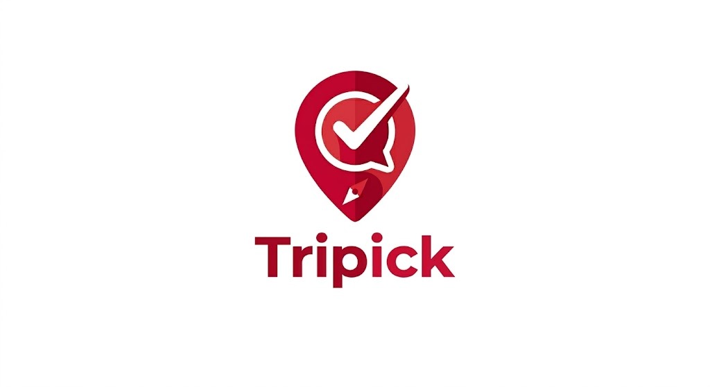
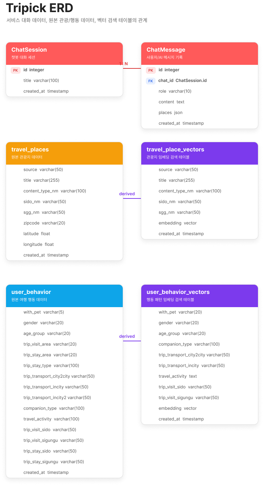

# SKN25-4th-5Team

  

  # ✈️ Tripick — AI 기반 국내 여행 추천 시스템

> RAG(검색 증강 생성)와 벡터 유사도 검색을 활용한 맞춤형 여행지 추천 및 일정 생성 서비스
---

# 1. 팀 소개 (Team Introduction)

<table>
  <tr>
    <td align="center"></td>
    <td align="center"></td>
    <td align="center"></td>
    <td align="center"></td>
  </tr>
  <tr>
    <th align="center">박성진</th>
    <th align="center">이상민</th>
    <th align="center">이채림</th>
    <th align="center">임하영</th>
  </tr>
  <tr>
    <td align="center"><a href="https://github.com/acegikmoop-code">acegikmoop</a></td>
    <td align="center"><a href="https://github.com/Sangmin630">Sangmin630</a></td>
    <td align="center"><a href="https://github.com/chaechae18">chaechae18</a></td>
    <td align="center"><a href="https://github.com/pureunsaerok-ship-it">pureunsaerok</a></td>
  </tr>
  <tr>
    <th align="center">전체 페이지<br>레이아웃 및 UI 설계</th>
    <th align="center">환경구축<br>LLM 테스트 및 성능 평가</th>
    <th align="center">여행지 추천 백엔드 API<br> 여행 챗봇 백엔드 API</th>
    <th align="center">요구사항 정의서<br>여행 플래너 백엔드 API</th>
  </tr>
</table>

---

# 2. 프로젝트 기간 (Project Period)

**Apr 28, 2026 - Apr 29, 2026**

---

# 3. 프로젝트 개요

## 프로젝트 배경 및 목적
* 특수 데이터 기반 맞춤형 큐레이션: 단순히 "가볼 만한 곳"이 아니라, 반려동물 동반 가능 여부와 무장애 시설 정보를 결합하여 정보의 사각지대에 있는 사용자들에게 실질적인 선택지를 제공합니다.

* 사용자 변수 반영 일정 최적화: 사용자가 설정한 출발 시간, 이동 수단, 여행 기간 등 세부 변수를 즉각 반영하여, 바로 실행에 옮길 수 있는 정교한 타임라인을 설계합니다.

* 멀티 에이전트 기반의 고도화된 응답: 데이터 검색(Retriever)과 일정 설계(Planner) 역할을 분담하는 멀티 에이전트 구조를 통해, 복잡한 사용자 요구사항에도 정확하고 논리적인 답변을 도출합니다.

## 대상 사용자 (Target Audience)
* 반려동물 동반 여행자: 반려동물과 함께 출입 가능한 식당, 카페, 숙소를 찾기 위해 수많은 리뷰를 직접 확인해야 했던 사용자.

* 교통 약자 및 보호자: 휠체어 접근성이나 유모차 이용 가능 여부 등 보편적인 이동권 보장이 필요한 교통 약자 및 가족 단위 여행자.

* 효율 중심의 여행 설계자: 정보 과부하 속에서 본인의 일정(시간/기간)에 딱 맞춰진 최적의 동선을 빠르게 제안받고 싶은 사용자.

* 시맨틱 검색 니즈가 있는 사용자: 단순 키워드 매칭을 넘어, 본인의 여행 성향과 맥락에 맞는 장소를 찾고 싶은 사용자.

---

# 4. 주요 기능

## 맞춤형 여행지 추천 (Recommendation Engine)
사용자의 여행 조건을 분석하여 맞춤형 여행지를 자동으로 추천합니다.
- **입력 정보**: 지역, 여행 목적(휴식·액티비티·문화), 동행자(혼자·가족·친구), 이동 수단
- **알고리즘**: 
  - 벡터 유사도 검색으로 기본 후보지 추출
  - 사용자의 행동 패턴 벡터와 매칭
  - GPT-4o-mini로 최종 추천 근거 및 카테고리 분류
- **결과**: 장소명, 지역, 카테고리, 상세 설명과 함께 추천 결과 제공

## 여행 챗봇 (Conversational RAG Chatbot)
여행 관련 질문에 실시간으로 답변하는 대화형 AI입니다.
- **대화 기능**:
  - 대화 히스토리를 유지하여 문맥 파악
  - 다중 회차 대화 세션 지원
  - 사용자별 채팅 기록 저장
- **답변 생성**:
  - RAG 파이프라인으로 관련 여행지 정보 자동 수집
  - GPT-4o-mini가 정보 기반 자연스러운 답변 생성
  - 답변에 포함된 여행지 자동 추출 및 저장
- **활용 예**: "가족과 강원도 가면 뭐해?", "부산 먹거리 추천해줘" 등

## 여행 플래너 (Itinerary Generation)
AI가 자동으로 시간대별 상세한 여행 일정을 생성합니다.
- **입력 정보**: 출발지, 목적지, 이동 수단, 여행 기간(1~14일), 여행 유형
- **생성 방식**:
  - 목적지 관련 모든 여행지를 벡터 검색으로 수집
  - RAG 기반 LLM이 시간대별로 구조화된 일정 생성
  - 장소 간 이동 거리, 운영 시간 등을 고려한 현실적인 루팅
- **결과**: 일차별·시간대별 활동(09:00 - 05:00 시간 단위) + 추천 장소 목록
## 의미 기반 벡터 검색 (Vector Search with pgvector)
PostgreSQL의 pgvector 확장을 활용한 고차원 벡터 검색입니다.
- **벡터화**:
  - OpenAI text-embedding-3-small으로 모든 여행지를 벡터로 변환
  - 사용자 쿼리와 행동 패턴도 동일한 차원으로 임베딩
- **검색 방식**:
  - `travel_place_vectors`: 여행지 특성(위치, 활동, 분위기) 기반 유사도 검색
  - `user_behavior_vectors`: 사용자 선호도 패턴 기반 행동 프로필 매칭
- **장점**: 키워드 검색보다 의미론적으로 더 정확한 추천
---

# 5. 디렉토리 구조
<details>
<summary>상세 디렉토리 구조 보기 (클릭)</summary>
<br />

```text
  SKN25-4th-5Team/
  │
  ├── .github/                    # GitHub 액션 및 설정
  ├── .git/                       
  ├── .gitignore                                  
  ├── .env.example              
  ├── docker-compose.yml   
  ├── README.md                   # 프로젝트 문서
  │
  │
  ├── frontend/                   # React 19 + Vite 프론트엔드
  │   ├── src/
  │   │   ├── App.jsx             # 메인 App 컴포넌트
  │   │   ├── App.css             # 글로벌 CSS
  │   │   ├── main.jsx            # React 진입점
  │   │   ├── index.css           # 기본 CSS 스타일
  │   │   │
  │   │   ├── assets/             # 이미지, 폰트 등 정적 자산
  │   │   │
  │   │   ├── components/         # 재사용 가능한 UI 컴포넌트
  │   │   │   ├── layout/         # 레이아웃 컴포넌트
  │   │   │   │   ├── Header.jsx  # 네비게이션 헤더
  │   │   │   │   ├── Header.css
  │   │   │   │   ├── Footer.jsx  # 페이지 푸터
  │   │   │   │   ├── Footer.css
  │   │   │   │   ├── Layout.jsx  # 전체 페이지 레이아웃
  │   │   │   │   └── Layout.css
  │   │   │
  │   │   ├── pages/              # 각 페이지 컴포넌트
  │   │   │   ├── Home.jsx        # 홈 페이지 (서비스 소개)
  │   │   │   ├── Home.css
  │   │   │   ├── Chatbot.jsx     # 챗봇 페이지 (AI 대화 인터페이스)
  │   │   │   ├── Chatbot.css
  │   │   │   ├── Search.jsx      # 검색 페이지 (여행지 추천)
  │   │   │   ├── Search.css
  │   │   │   ├── Schedule.jsx    # 일정 생성 페이지 (다일 여행 계획)
  │   │   │   └── Schedule.css
  │   │   │
  │   │   └── routes/
  │   │       └── Router.jsx      # React Router 설정 및 라우팅
  │   │
  │   ├── index.html              # HTML 진입점
  │   ├── vite.config.js          # Vite 빌드 설정
  │   ├── eslint.config.js        # ESLint 설정
  │   ├── package.json            # npm 의존성 및 스크립트
  │   ├── Dockerfile              # 프로덕션 Docker 이미지 빌드
  │   ├── nginx.conf              # Nginx 리버스 프록시 설정 (프로덕션)
  │   └── README.md               # 프론트엔드 문서
  │
  ├── backend/                    # Django REST API 백엔드
     ├── manage.py               # Django 관리 커맨드 진입점
     ├── requirements.txt        # Python 의존성 목록
     ├── pytest.ini              # pytest 테스트 설정
     ├── Dockerfile              # Django Docker 이미지 빌드
     │
     ├── config/                 # Django 프로젝트 설정
     │   ├── __init__.py
     │   ├── settings.py         # 프로젝트 설정 (DB, 미들웨어, 앱 등)
     │   ├── urls.py             # 메인 URL 라우팅 설정
     │   ├── wsgi.py             # WSGI 서버 진입점 (프로덕션)
     │   └── asgi.py             # ASGI 서버 진입점 (비동기 지원)
     │
     ├── api/                    # 공통 API 앱 (기존 API)
     │   ├── __init__.py
     │   ├── models.py           # 데이터 모델 정의
     │   ├── views.py            # API 뷰
     │   ├── urls.py             # API URL 라우팅
     │   ├── admin.py            # Django Admin 설정
     │   ├── apps.py             # 앱 설정
     │   ├── tests.py            # 단위 테스트
     │   └── migrations/         # 데이터베이스 마이그레이션 파일
     │
     ├── apps/                   # Django 기능별 앱들
     │   ├── __init__.py
     │   │
     │   ├── chat/               # 채팅 기능 앱
     │   │   ├── __init__.py
     │   │   ├── models.py       # ChatSession, ChatMessage 모델
     │   │   ├── views.py        # 채팅 API 엔드포인트
     │   │   ├── urls.py         # 채팅 관련 URL 라우팅
     │   │   ├── admin.py        # Django Admin
     │   │   ├── apps.py         # 앱 설정
     │   │   ├── services.py     # 채팅 비즈니스 로직
     │   │   ├── tests.py        # 테스트 코드
     │   │   └── migrations/     # DB 마이그레이션
     │   │
     │   ├── recommendations/    # 여행지 추천 앱
     │   │   ├── __init__.py
     │   │   ├── models.py       # 추천 관련 모델
     │   │   ├── views.py        # 추천 API 엔드포인트
     │   │   ├── urls.py         # 추천 URL 라우팅
     │   │   ├── serializers.py  # DRF 직렬화기
     │   │   ├── admin.py        # Django Admin
     │   │   ├── apps.py         # 앱 설정
     │   │   ├── services.py     # 추천 로직
     │   │   ├── tests.py        # 테스트
     │   │   └── migrations/     # DB 마이그레이션
     │   │
     │   └── plans/              # 여행 일정 생성 앱
     │       ├── __init__.py
     │       ├── models.py       # 일정 관련 모델
     │       ├── views.py        # 일정 생성 API 엔드포인트
     │       ├── urls.py         # 일정 URL 라우팅
     │       ├── serializers.py  # DRF 직렬화기
     │       ├── admin.py        # Django Admin
     │       ├── apps.py         # 앱 설정
     │       ├── services.py     # 일정 생성 로직
     │       ├── tests.py        # 테스트
     │       └── migrations/     # DB 마이그레이션
     │
     ├── ai/                     # AI/ML 핵심 엔진
     │   ├── llm.py              # OpenAI GPT 호출 및 프롬프트 관리
     │   │
     │   ├── rag.py              # RAG 파이프라인 구현
     │   │                        
     │   │                        
     │   │                        
     │   │
     │   └── retriever.py        # 벡터/데이터 검색 모듈
     │                                                                                                              
     ├── scripts/            # 설정 및 데이터 처리 스크립트
     │   ├── loader.py           # 데이터 로드 및 DB 초기화
     │   ├── build_place_vectors.py
     │   │                        # 여행지 데이터를 벡터화하여 DB에 저장
     │   │                        # travel_place_vectors 테이블 생성
     │   │
     │   └── build_behavior_vectors.py
     │                            # 사용자 행동 패턴 벡터 생성
     │                            # user_behavior_vectors 테이블 생성
     │
     ├── tests/                  # 테스트 디렉토리
     │   ├── test_api.py         # API 엔드포인트 테스트
     │   └── test_llm.py         # LLM 관련 테스트
     │
     ├── evals/                  # 평가 및 벤치마킹
     │   ├── chat_eval_examples.json
     │   │                        # 챗봇 평가 데이터셋
     │   ├── create_chat_eval_dataset.py
     │   │                        # 평가 데이터셋 생성
     │   │
     │   └── run_chat_eval.py    # 챗봇 성능 평가 실행
     │
     ├── db/                     # 데이터베이스 저장소
     │   └── processed/          # 처리된 데이터 저장
     │
     └── .pytest_cache/          # pytest 캐시
```
</details>

# 6. 환경 변수 설정 및 실행 방법
<details>
<summary>상세 환경 변수 설정 및 실행 방법 보기 (클릭)</summary>
<br />

## 환경 변수 설정
프로젝트 루트에 `.env` 파일을 생성하세요. `.env.example`을 참고하세요.

```bash
cp .env.example .env
```

| 변수명 | 설명 | 예시 |
|--------|------|------|
| `DJANGO_SECRET_KEY` | Django 시크릿 키 | `your-secret-key` |
| `DJANGO_DEBUG` | 디버그 모드 | `True` |
| `DJANGO_ALLOWED_HOSTS` | 허용 호스트 | `localhost,127.0.0.1,backend` |
| `DJANGO_CORS_ALLOWED_ORIGINS` | CORS 허용 출처 | `http://localhost:5173` |
| `POSTGRES_DB` | DB 이름 | `skn25` |
| `POSTGRES_USER` | DB 사용자 | `skn25` |
| `POSTGRES_PASSWORD` | DB 비밀번호 | |
| `POSTGRES_HOST` | DB 호스트 | `db` (Docker), `localhost` (로컬) |
| `POSTGRES_PORT` | DB 포트 | `5432` |
| `OPENAI_API_KEY` | OpenAI API 키 | `sk-...` |
| `VITE_API_URL` | 프론트엔드에서 사용하는 API URL | `http://localhost:8000` |

---

## 실행 방법

### Docker Compose (권장)

```bash
# 1. 환경 변수 설정
cp .env.example .env
# .env 파일에 실제 값 입력

# 2. 컨테이너 빌드 및 실행
docker-compose up --build

# 3. 벡터 DB 초기화 (최초 1회)
docker-compose exec backend python scripts/build_place_vectors.py
docker-compose exec backend python scripts/build_behavior_vectors.py
```

| 서비스 | 주소 |
|--------|------|
| 프론트엔드 | http://localhost:5173 |
| 백엔드 API | http://localhost:8000 |

---

### 로컬 개발

**Backend**

```bash
cd backend
python -m venv venv
source venv/bin/activate        # Windows: venv\Scripts\activate
pip install -r requirements.txt
python manage.py migrate
python manage.py runserver 0.0.0.0:8000
```

**Frontend**

```bash
cd frontend
npm install
npm run dev        # 개발 서버 (HMR 지원)
npm run build      # 프로덕션 빌드
```

---

## API 엔드포인트

### 채팅 (`/api/chat/`)

| 메서드 | 경로 | 설명 |
|--------|------|------|
| `POST` | `/api/chat/` | 메시지 전송 및 AI 응답 수신 |
| `POST` | `/api/chat/create/` | 새 채팅 세션 생성 |
| `POST` | `/api/chat/save/` | 메시지 저장 |
| `GET`  | `/api/chat/list/` | 채팅 세션 목록 조회 |
| `GET`  | `/api/chat/{chat_id}/` | 특정 세션의 대화 히스토리 조회 |
| `DELETE` | `/api/chat/{chat_id}/` | 채팅 세션 삭제 |

### 추천 (`/api/recommend/`)

| 메서드 | 경로 | 설명 |
|--------|------|------|
| `POST` | `/api/recommend/` | 여행지 추천 (지역·카테고리·동행자 기반) |

### 일정 (`/api/plan`)

| 메서드 | 경로 | 설명 |
|--------|------|------|
| `POST` | `/api/plan` | 다일 여행 일정 생성 |
</details>


# 7. 파이프라인 구조, ERD, 요구사항 정의서, 화면 설계서

<details>
<summary> 파이프라인 및 ERD 시각화 자료 보기 (클릭)</summary>
<br />

###  AI 파이프라인 구조


###  데이터베이스 ERD


### 요구사항 정의서
[요구사항 정의서](./PRD.md)

### 화면 설계서


</details>


---
# 8. 페이지 소개
<details>
<summary> 페이지 시연 보기 (클릭)</summary>
<br />

### 서비스 소개


### 맞춤형 여행 추천

  
### 여행 챗봇


### 여행 플래너


</details>


---
# 9. 테스트 계획 및 결과 보고서
<details>
<summary> 테스트 계획 및 결과 보고서 보기 (클릭)</summary>
<br />
  
## 1. 개요

본 프로젝트는 Django 기반 백엔드, React 기반 프론트엔드, LangChain/OpenAI를 활용한 RAG 기반 여행 추천 및 질의응답 시스템이다.  
본 문서는 시스템의 기능 정상 동작 여부와 LLM 응답 품질을 검증하기 위해 수행한 테스트 계획과 결과를 정리한다.

---

## 2. 테스트 목적

- 백엔드 API 정상 동작 여부 확인
- 여행지 추천, 챗봇, 일정 생성 기능 검증
- LLM 응답 품질 비교 및 최적 버전 선정
- GitHub Actions 기반 자동 테스트 환경 검증

---

## 3. 테스트 환경

- Backend: Django, Django REST Framework
- Frontend: React, Vite
- Database: PostgreSQL + pgvector
- LLM/RAG: LangChain, OpenAI, LangSmith
- Test: pytest, GitHub Actions
- Runtime: Docker Compose

---

## 4. 테스트 대상

- 챗봇 API
- 여행지 추천 API
- 일정 생성 API
- RAG 기반 응답 생성 로직
- LangSmith 평가 실험
- GitHub Actions 자동 테스트 환경

---

## 5. 테스트 계획

### 5.1 기능 테스트

- 챗봇 API 요청 및 응답 확인
- 추천 API 입력값 검증 및 결과 반환 확인
- 일정 생성 API 결과 구조 확인
- 채팅 생성, 저장, 조회, 삭제 기능 확인

### 5.2 LLM 품질 평가

LangSmith를 활용하여 동일한 질문셋으로 여러 프롬프트 버전을 반복 실험

평가 항목:
- 답변 생성 여부
- 기대 키워드 반영 여부
- 금지 키워드 포함 여부
- 추천 장소 수 적절성
- 답변 관련성 및 자연스러움

### 5.3 자동화 테스트

GitHub Actions 기반 CI 구성

- push / pull request 시 backend 테스트 자동 실행
- Docker 환경에서 migration 및 pytest 수행
- 기능 이상 여부 사전 검증

---

## 6. 평가 기준

| 지표 | 설명 |
|------|------|
| answer_exists | 답변이 정상 생성되었는지 |
| expected_keywords_match | 핵심 키워드 반영 여부 |
| forbidden_keywords_absent | 부적절한 키워드 미포함 여부 |
| place_count_ok | 추천 장소 수 적절성 |
| llm_relevance_judge | 답변 관련성 및 자연스러움 (1~5점) |

---

## 7. 테스트 수행 내용

### 7.1 기능 테스트

pytest를 활용하여 backend 테스트 수행

검증 항목:
- 챗봇 API
- 추천 API
- 일정 생성 API
- 채팅 CRUD 기능

결과: 전체 테스트 통과

---

### 7.2 LLM 품질 평가

LangSmith dataset을 구성하여 동일 질문셋으로 실험 진행

비교 대상:
- baseline
- prompt v2
- prompt v3
- retrieval 개선 실험

---

### 7.3 자동화 테스트

GitHub Actions 기반 자동화 수행

실행 흐름:

backend 컨테이너 빌드  
→ database 실행  
→ migration 수행  
→ pytest 실행  

초기에는 secret key 및 DB password 누락으로 실패 발생  
→ GitHub Secrets 추가 후 해결

---

## 8. 테스트 결과

### 8.1 기능 테스트

- 챗봇 API: 정상 동작
- 추천 API: 정상 동작
- 일정 생성 API: 정상 동작
- 채팅 CRUD: 정상 동작
- pytest: 전체 통과

---

### 8.2 LLM 품질 평가

여러 프롬프트 비교 결과:

👉 3번째 실험 버전이 가장 높은 품질 점수 기록

추가 규칙 및 retrieval 개선 실험 진행했으나  
기존보다 높은 성능은 나오지 않음

👉 최종 선택: **Prompt v3**

---

### 8.3 자동화 테스트

- GitHub Actions 기반 CI 구축 완료
- 초기 환경변수 누락 문제 해결
- backend 테스트 자동 실행 가능 상태 확보

---

## 9. 문제점 및 개선 사항

- 프롬프트 규칙 과도 추가 시 품질 저하 발생
- retrieval 개선이 항상 성능 향상으로 이어지지 않음
- 프롬프트와 검색 품질 간 균형 중요
- CI 환경에서 secret 및 환경변수 관리 중요

---

## 10. 결론

기능 테스트와 LLM 품질 평가를 통해 시스템 안정성과 응답 품질을 검증하였다.

- pytest + GitHub Actions → 기능 테스트 자동화
- LangSmith → 프롬프트 품질 비교 및 평가

최종적으로 가장 높은 성능을 보인 **Prompt v3**를 채택하였으며,  
테스트 기반으로 개선 방향을 도출할 수 있는 체계를 구축하였다.

</details>

# 10.기술 스택 (Tech Stack)

### Frontend


### Backend


### AI / ML


### Database


### DevOps / MLOps


### Infrastructure


### Collaboration


---
# 11. 한 줄 회고
> &nbsp;**박성진** : "AI 에이전트 설계(3차)부터 React 중심의 서비스 구현(4차)까지 경험하며, AI 기술의 핵심 로직과 이를 사용자에게 전달하는 UI 구현력을 모두 갖춘 풀스택적 시야를 확보하게 되었습니다."
>
>&nbsp;**이상민** : “이번에는 LangSmith, pytest, GitHub Actions를 활용한 테스트와 실험 과정을 추가하면서, 단순히 기능 구현을 넘어서 결과를 검증하고 개선하는 방법까지 새롭게 배울 수 있었다.”

>
> &nbsp;**이채림** : “LLM이 실제 DB 기반으로 답변하도록 프롬프트와 검색 로직을 조정하며, AI 서비스에서는 데이터 품질과 응답 제어가 중요하다는 점을 배웠다. 
짧은 기간이라 정교화는 아쉬웠지만, 백엔드와 프론트엔드가 연결된 실사용 흐름을 경험할 수 있었다.”
>
> &nbsp;**임하영** : “요구사항 정의서를 직접 정리하고 이를 바탕으로 여행 플래너 백엔드 API를 구현하면서 전체 개발 흐름을 이해할 수 있었고, LLM 프롬프트 성능 개선을 위해 다양한 방식으로 실험을 진행하며 결과의 차이도 직접 확인할 수 있었습니다. 아직 부족한 부분이 많지만 이러한 과정을 통해 설계와 개선의 중요성을 자연스럽게 느낄 수 있었습니다.”
>
> ---


